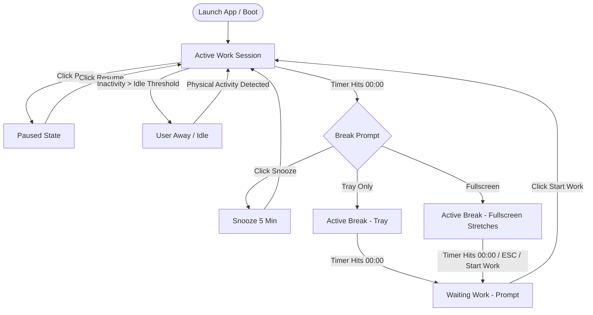

# O2om (قُوم) — Stand-Up & Physical Health Reminder

> **O2om** — A lightweight, modern, localized desktop health utility for Windows built with AutoHotkey v2.

---

## Download O2om

[**Download Latest Executable (O2om.exe)**](https://github.com/BelalWaheed/o2om/releases/latest/download/O2om.exe)

_No installation required! Download `O2om.exe`, double-click to run, and it will sit quietly in your System Tray._

---

## Quick User Guide

### What is O2om?

**O2om** (from the Arabic word **قُوم**, meaning _"Stand up!"_) helps software developers, gamers, remote workers, and desk users maintain physical health, prevent eye strain, and fix sedentary posture.

---

### Key Usage Steps

1. **Launch**: Double-click `O2om.exe`. Your work countdown starts automatically.
2. **Pause / Resume**: Click **Pause** anytime to freeze the timer if you step away from your desk.
3. **Break Prompt (`00:00`)**: Choose between **Tray Break**, **Fullscreen Exercises** (16:9 posture stretches), or **Snooze** (5 min delay).
4. **Post-Break**: When the break finishes, click **"Start Work"** to begin your next session.
5. **Settings & Language**: Switch seamlessly between **العربية** (with native Right-To-Left layout) and **English** from the Settings tab.

---

## Want more custimization

### Prerequisites & Source Setup

To run or modify O2om from source:

1. Windows OS (10 or 11).
2. [AutoHotkey v2.0+](https://www.autohotkey.com/) installed.
3. Double-click `O2om.ahk` to run from source.

---

### System Flowchart



---

### Repository & Folder Structure

```text
O2om/
├── O2om.ahk                  # Main Entry Point & Orchestrator (O2omApp)
├── O2om.exe                  # Standalone Compiled Executable
├── o2om_config.ini           # User Settings Persistence File
├── README.md                 # Complete Documentation
├── assets/                   # Application Binary & Graphic Assets
│   ├── o2om.ico              # Main Application & System Tray Icon
│   └── exercises_bg.png      # 16:9 Clean 5-Panel Gesture Illustration
├── lib/                      # Core Modular Codebase
│   ├── TimerEngine.ahk       # State Machine & Countdown Math (O2omEngine)
│   ├── Settings.ahk          # INI File Manager (O2omSettings)
│   ├── Language.ahk          # Localization Dictionary (O2omLang)
│   ├── Styles.ahk            # Design Tokens & Palette (O2omStyles)
│   ├── Notifications.ahk     # Native Windows Toast & Sound (O2omNotify)
│   ├── Tray.ahk               # System Tray Menu & Tooltip (O2omTray)
│   ├── Startup.ahk            # Windows Autostart Registry Manager (O2omStartup)
│   └── Gui/                  # Presentation Layer
│       ├── Dashboard.ahk      # Main Timer View Controls (O2omDashboardView)
│       └── SettingsView.ahk   # Configuration Form Controls (O2omSettingsView)
└── .agents/                  # AI Agent Rules & Engineering Skills
    ├── AGENTS.md             # Project Coding & Layout Invariants
    └── skills/               # Reusable AutoHotkey v2 Patterns
        └── autohotkey-v2-gui-patterns/SKILL.md
```

#### Folder Structure Evaluation:

- **Modular & Decoupled**: `lib/` cleanly separates business logic (`TimerEngine.ahk`), configuration (`Settings.ahk`), and infrastructure (`Tray.ahk`, `Notifications.ahk`) from presentation views (`lib/Gui/`).
- **Multi-Language Architecture**: `Language.ahk` provides centralized dictionary lookups for Arabic and English.
- **Resource Management**: Binary icons and graphics are isolated inside `assets/`.

---

### Critical Edge Cases & Engineering Invariants

1. **Zero Text Redraw Flicker (`WS_CLIPCHILDREN`)**:
   - All `Gui` initializations include `+0x02000000` (`WS_CLIPCHILDREN`) to eliminate text control flickering during 1-second updates.
2. **Native Windows RTL Layout Mirroring (`WS_EX_LAYOUTRTL`)**:
   - Arabic mode applies `+E0x400000` (`WS_EX_LAYOUTRTL`) to the main window for native control mirroring.
3. **Visibility Ghosting Cleanup (`WinRedraw`)**:
   - `ToggleDashboardButtons()` calls `WinRedraw("ahk_id " gui.Hwnd)` after toggling control visibility.
4. **Destroyed Control Exception Guarding**:
   - Control property updates in `UpdateDisplay()` are wrapped in `try` blocks to prevent crash race conditions.
5. **32-Bit Tick Wraparound & Sleep/Wake Gap**:
   - `TimerEngine.ahk` handles negative `delta` rollover (`delta += 0x100000000`) and sleep gaps (`SLEEP_GAP > 5000ms`).
6. **Responsive Screen Scaling**:
   - Exercise view dynamically calculates 16:9 image boundaries for 768p up to 4K displays.

---

### INI File Configuration (`o2om_config.ini`)

Advanced users can edit `o2om_config.ini` directly while the app is closed:

```ini
[General]
Language=ar

[Timer]
WorkInterval=40
ShortBreak=5
LongBreak=15
EscalationInterval=2
SnoozeDuration=5
IdleThreshold=5
CyclesBeforeLong=4
```

---

### How to Compile to `.exe`

Using **Ahk2Exe** (AutoHotkey Compiler)

---

## Part 3: AI Agent Integration (`.agents/`)

This repository is equipped with an **AI Agent Context System** inside `.agents/`.

When an AI coding assistant (such as **Google Antigravity / Gemini**) opens this codebase, it automatically loads:

1. **[.agents/AGENTS.md](file:///b:/projects/personal/O2om/.agents/AGENTS.md)**: Workspace invariants (Arabic RTL `+E0x400000` rules, `WS_CLIPCHILDREN` `+0x02000000` zero-flicker mandates, `WinRedraw` ghosting cleanup, text-free exercise graphic constraints, and post-break window destruction flows).
2. **[.agents/skills/autohotkey-v2-gui-patterns/SKILL.md](file:///b:/projects/personal/O2om/.agents/skills/autohotkey-v2-gui-patterns/SKILL.md)**: Reusable technical patterns for flicker-free AHK v2 GUI development.

---

## License & Copyright

Copyright (c) 2026 O2om Team. Free for personal wellness and productivity.

---

> Its Never Too Late For **COFFEE**
