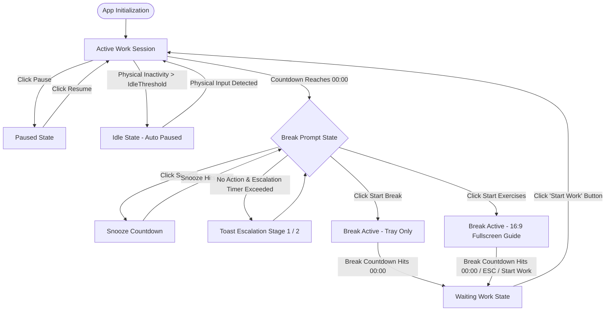
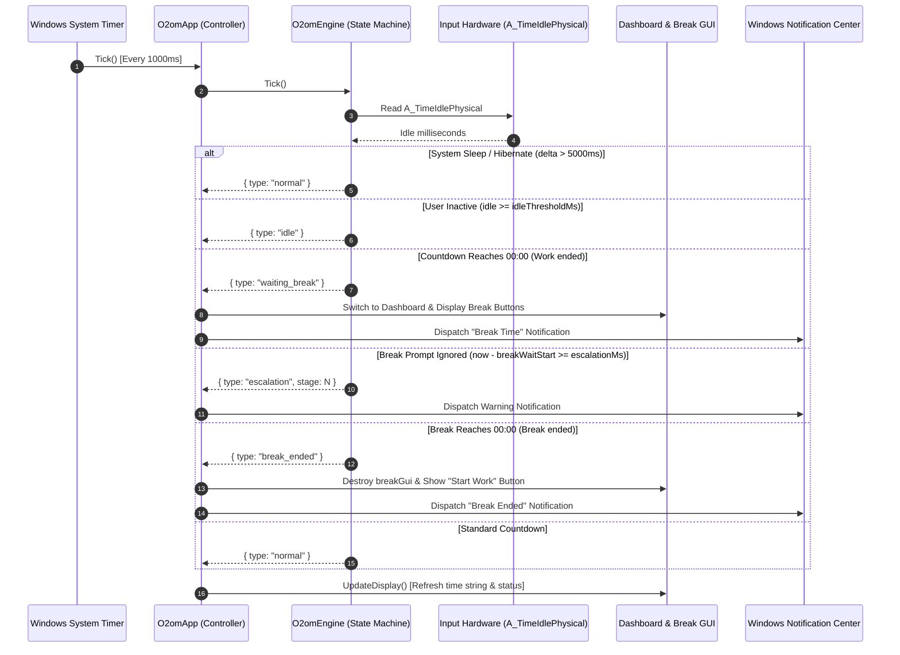
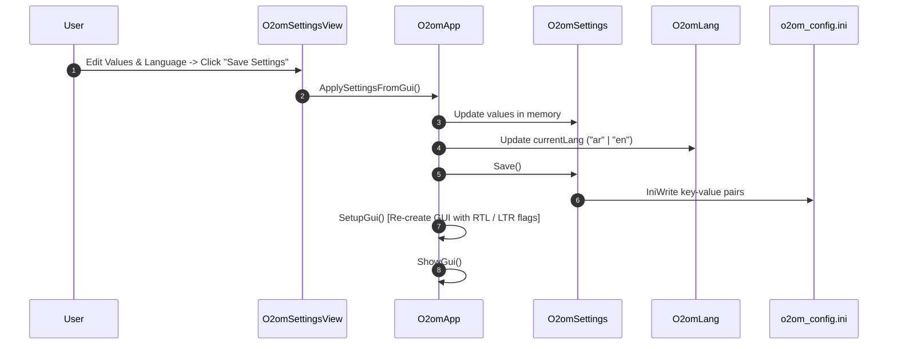

# O2om (قُوم) — Workflows & Runtime State Sequences

This document outlines the state machine transitions, background tick lifecycle, break decision branches, and configuration update workflows for **O2om**.

---

## 1. Complete Application State Machine

---

## 2. 1-Second Timer Tick Sequence Diagram

The central `SetTimer(ObjBindMethod(this, "Tick"), 1000)` loop evaluates hardware inputs, delta time, and state transitions every 1,000 milliseconds:

---

## 3. Detailed Workflow Descriptions

### A. Active Work Session & Idle Recovery
1. When launched, `O2omEngine` starts in a working session with `remaining = workIntervalMin * 60 * 1000`.
2. Every tick, delta time is deducted from `remaining`.
3. If the user stops interacting with mouse and keyboard, `A_TimeIdlePhysical` begins incrementing.
4. Once `idle >= idleThresholdMs`, the engine enters `isIdle` mode, suspending countdown deduction.
5. As soon as the user returns (hardware input detected, `idle < idleThresholdMs`), the engine resets to a fresh work interval.

### B. Break Trigger & Escalation Workflow
1. When work timer reaches `00:00`, the engine transitions into `isWaitingBreak`.
2. The main window pops to the front, displaying three prominent choices:
   - **Start Break (Tray Only)**: Starts countdown quietly in tray without blocking the display.
   - **Start Exercises (Fullscreen)**: Opens a dedicated 16:9 illustration displaying posture exercises.
   - **Snooze**: Postpones the break for `snoozeMin` minutes.
3. If the prompt is ignored, the engine checks `now - breakWaitStart >= escalationMs` and dispatches escalating warnings (`stage 1` and `stage 2`).

### C. Post-Break Workflow (Clean Resumption)
1. When the break countdown expires (`00:00`), the fullscreen exercise overlay is completely destroyed (`breakGui.Destroy()`).
2. The engine transitions into `isWaitingWork` state and resets `remaining = workIntervalMin * 60 * 1000`.
3. The main dashboard appears with a prominent **"Start Work"** button.
4. The timer does **not** count down until the user explicitly clicks **"Start Work"**, ensuring the user is truly seated and ready.

---

## 4. Settings Update & Language Switch Workflow

